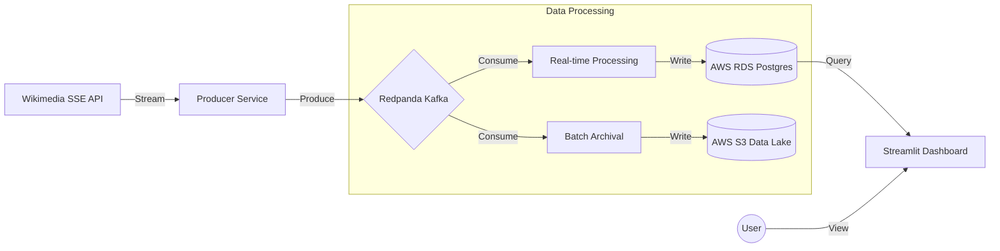

# Wiki Data Analysis System Report (v1.0)

## 1. Tổng Quan Hệ Thống
Hệ thống **Wiki Data Analysis** là một nền tảng xử lý dữ liệu lớn (Big Data) theo thời gian thực (Real-time). Hệ thống có nhiệm vụ thu thập hàng nghìn sự kiện thay đổi (Edits, New Pages) từ Wikipedia toàn cầu, xử lý, lưu trữ và hiển thị lên Dashboard trực quan giúp theo dõi xu hướng nội dung ngay lập tức.

---

## 2. Kiến Trúc Tổng Thể (Architecture)

Hệ thống được thiết kế theo mô hình **Event-Driven Architecture** (EDA) hiện đại, đảm bảo khả năng mở rộng và chịu tải cao.



---

## 3. Các Thành Phần Chi Tiết (Components)

### 3.1. Ingestion Layer (Thu Thập)
*   **Service:** `producer` (Python)
*   **Chức năng:** Kết nối liên tục vào luồng Server-Sent Events (SSE) của Wikimedia.
*   **Nhiệm vụ:** Lọc dữ liệu thô, chuẩn hóa format (JSON) và đẩy vào hàng đợi Message Broker.
*   **Công nghệ:** `sseclient`, `kafka-python`.

### 3.2. Message Broker (Trung Chuyển)
*   **Service:** `redpanda` (Kafka-compatible)
*   **Chức năng:** "Trái tim" của hệ thống, nơi trung chuyển dữ liệu giữa Producer và Consumer.
*   **Đặc điểm:** Tốc độ cực cao, độ trễ thấp, đảm bảo không mất dữ liệu dù hệ thống xử lý bị chậm.

### 3.3. Processing Layer (Xử Lý)
*   **Service:** `processing` (Quix Streams)
*   **Chức năng:** Consumer chính. Đọc dữ liệu từ Redpanda.
*   **Logic:**
    *   Nhận dữ liệu theo dòng (Stream).
    *   Gom dữ liệu vào bộ nhớ đệm (Micro-batching) ~100 events/lần.
    *   **Sink (Ghi):** Ghi dữ liệu đã xử lý vào Database (RDS).
*   **Công nghệ:** `quixstreams` (Thư viện xử lý Stream mạnh mẽ).

### 3.4. Storage Layer (Lưu Trữ)
*   **Hot Storage (AWS RDS PostgreSQL):**
    *   Lưu trữ dữ liệu phục vụ cho Dashboard (Traffic, Recent Changes).
    *   Bảng chính: `realtime_traffic_volume`, `realtime_recent_changes`.
    *   Đặc điểm: Truy xuất cực nhanh, hỗ trợ SQL phức tạp.
*   **Cold Storage (AWS S3):**
    *   Lưu trữ dữ liệu thô (Raw Data) lâu dài dưới dạng file Parquet.
    *   Nhiệm vụ: Phục vụ Data Lake, Training AI sau này.

### 3.5. Presentation Layer (Hiển Thị)
*   **Service:** `dashboard` (Streamlit)
*   **Chức năng:** Giao diện người dùng.
*   **Logic:**
    *   Kết nối trực tiếp tới AWS RDS.
    *   Sử dụng SQL Aggregation để tính toán "nóng" các chỉ số (Top Server, User stats...).
    *   Tự động làm mới (Auto-refresh) mỗi 8 giây.
*   **Công nghệ:** `streamlit`, `pandas`, `plotly`.

---

## 4. Luồng Dữ Liệu (Data Flow)

1.  **Sự kiện:** Một người dùng ở Đức sửa bài viết trên `de.wikipedia.org`.
2.  **Ingest:** `Producer` bắt được sự kiện này ngay lập tức, đóng gói và gửi vào Topic `wiki-raw-events` trên Redpanda.
3.  **Process:** `Processing` service nhận được tin nhắn, thêm vào batch hiện tại.
4.  **Persist:** Khi đủ batch (100 msg), dữ liệu được INSERT vào bảng `realtime_recent_changes` trên AWS RDS.
5.  **Visualize:** Dashboard (đang mở trên máy người dùng) chạy câu lệnh SQL query 30 phút gần nhất, phát hiện dòng dữ liệu mới và cập nhật biểu đồ "Live Velocity" và "Top Server".

---

## 5. Hạ Tầng Triển Khai (Infrastructure)

*   **Cloud Provider:** AWS (Amazon Web Services).
*   **Compute (Máy chủ):** Amazon EC2 (Ubuntu Linux). Chạy toàn bộ Docker Containers.
*   **Database:** Amazon RDS (PostgreSQL Free Tier). Quản lý bởi AWS, an toàn, tự động backup.
*   **Containerization:** Docker & Docker Compose. Giúp môi trường đồng nhất (Dev = Prod).

## 6. Vận Hành & Bảo Trì

*   **Khởi động hệ thống:**
    ```bash
    docker-compose up -d
    ```
*   **Xem logs:**
    ```bash
    docker-compose logs -f processing
    ```
*   **Kiểm tra dữ liệu:** Truy cập Dashboard qua trình duyệt hoặc dùng script `scripts/check_stats.py`.
*   **Dừng hệ thống (Bảo trì):**
    ```bash
    docker-compose down
    ```
    (Dữ liệu vẫn an toàn tuyệt đối trên RDS).
