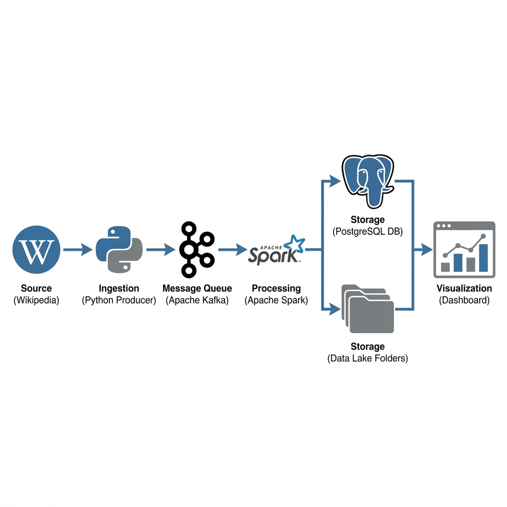
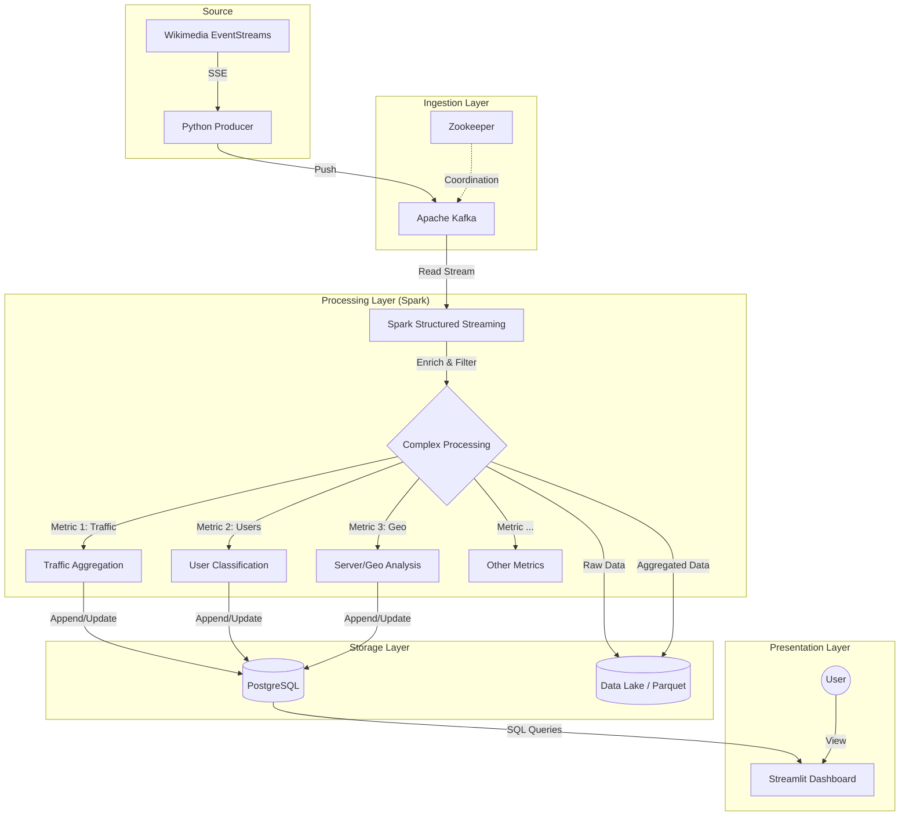

# Wiki Data Pipeline - Báo cáo dự án toàn diện

## 1. Tóm tắt điều hành

Dự án này là một **Real-time Big Data Pipeline** được thiết kế để nhập, xử lý và trực quan hóa luồng "Recent Changes" (Thay đổi gần đây) toàn cầu của Wikimedia. Bằng cách tận dụng các nguyên tắc của **Kiến trúc Lambda**, hệ thống cung cấp cả thông tin chi tiết có độ trễ thấp (Speed Layer) và lưu trữ dữ liệu lịch sử dài hạn (Batch/Serving Layer).

**Các khả năng chính:**
*   **Real-time Ingestion**: Tiếp nhận hàng nghìn sự kiện mỗi giây từ luồng sự kiện toàn cầu của Wikimedia.
*   **Stream Processing**: Sử dụng Apache Spark Structured Streaming để tính toán các phân tích phức tạp ngay lập tức (lưu lượng truy cập, phát hiện bot, định vị địa lý, tốc độ nội dung).
*   **Live Dashboarding**: Trình bày trực quan hóa hoạt động Wikipedia toàn cầu với độ trễ dưới giây bằng Streamlit và Plotly.
*   **Scalable Infrastructure**: Được container hóa với Docker và điều phối qua Kubernetes để đảm bảo tính sẵn sàng cao và khả năng mở rộng.

---

## 2. Kiến trúc hệ thống

Hệ thống tuân theo kiến trúc dữ liệu streaming hiện đại:



<details>
<summary>Xem mã nguồn (Mermaid)</summary>



</details>

---

## 3. Cấu trúc thư mục và Phân tích thành phần

### 3.1. Cấu trúc dự án
Mã nguồn được tổ chức thành các mô-đun logic phản ánh các giai đoạn của pipeline dữ liệu:

```
/home/thanh123/workspace/bigdata
├── ingestion/          # Dịch vụ Producer để lấy dữ liệu từ Wikimedia
├── processing/         # Các công việc Spark cho xử lý luồng (stream processing)
├── dashboard/          # Giao diện Streamlit để trực quan hóa
├── infrastructure/     # Infrastructure as Code (Docker, K8s)
├── config/             # Quản lý cấu hình tập trung
├── datalake/           # Lưu trữ cục bộ cho dữ liệu thô/đã xử lý
└── run_all.sh          # Script chính để triển khai Kubernetes
```

### 3.2. Phân tích chi tiết thành phần

#### A. Ingestion Layer (`ingestion/`)
*   **Core File**: `producer.py`
*   **Chức năng**: Hoạt động như điểm nhập cho dữ liệu. Nó kết nối với API Server-Sent Events (SSE) `v2/stream/recentchange` của Wikimedia.
*   **Các tính năng chính**:
    *   **Filtering**: Loại bỏ nhiễu (ví dụ: các trang 'talk', namespace không liên quan).
    *   **Enrichment**: Thêm các trường được tính toán như `bytes_changed`, `is_bot`, `language`, `project` (được suy ra từ tên miền server).
    *   **Kafka Integration**: Tuần tự hóa các sự kiện JSON và đẩy vào topic Kafka `wiki-raw-events`. Bao gồm khả năng phục hồi kết nối và xử lý theo lô (batching).

#### B. Processing Layer (`processing/`)
*   **Core File**: `stream_job.py`
*   **Công nghệ**: Apache Spark Structured Streaming (PySpark).
*   **Chức năng**: Đọc từ Kafka, phân tích cú pháp JSON và tính toán các chỉ số thời gian thực toàn diện.
*   **Các chỉ số được tính toán**:
    1.  **Traffic Volume**: Tổng số bytes và số lượng sự kiện (sliding window).
    2.  **User Distribution**: Tỷ lệ hoạt động của Bot so với Con người.
    3.  **Action Breakdown**: Các loại hành động (edit, new, log).
    4.  **Server Activity**: Các dự án Wikimedia hoạt động tích cực nhất (en.wiki, fr.wiki, v.v.).
    5.  **Content Velocity**: Số sự kiện mỗi giây.
    6.  **Leaderboards**: Các trang được chỉnh sửa nhiều nhất và người dùng tích cực nhất.
    7.  **Edit Severity**: Phân biệt giữa chỉnh sửa nhỏ và lớn.
    8.  **Content Volume Change**: Số lượng thêm vào ròng so với xóa đi.
*   **Chiến lược lưu trữ**:
    *   **Speed Layer (PostgreSQL)**: Các chỉ số tổng hợp được ghi qua JDBC để dashboard truy vấn với độ trễ thấp.
    *   **Batch Layer (Data Lake)**: Các sự kiện thô và chỉ số được lưu trữ ở định dạng Parquet để phân tích lịch sử.

#### C. Dashboard Layer (`dashboard/`)
*   **Core File**: `app.py`
*   **Công nghệ**: Streamlit, Plotly, Pandas.
*   **Chức năng**: Trực quan hóa các thông tin chi tiết được lưu trữ trong PostgreSQL.
*   **Các tính năng chính**:
    *   **Live Key Performance Indicators (KPIs)**: Tổng sự kiện, khối lượng, tốc độ.
    *   **Interactive Controls**: Adjustable lookback windows (1 phút - 3 giờ), tốc độ làm mới và các bộ lọc.
    *   **Advanced Charts**:
        *   **Real-time Scatter Plot**: "The Battlefield" - trực quan hóa các chỉnh sửa khi chúng xảy ra (kích thước = tác động, màu sắc = thêm/xóa).
        *   **Dynamic Leaderboards**: Top servers, ngôn ngữ và trang.
        *   **User Engagement Histograms**: Phân phối mức độ hoạt động của người dùng.
    *   **Monitoring**: "Blacklist Monitor" dựa trên từ khóa để theo dõi các thuật ngữ cụ thể trong thời gian thực.

#### D. Infrastructure (`infrastructure/` & `config/`)
*   **Cấu hình**: `config/settings.py` sử dụng `pydantic` dataclasses và `python-dotenv` cho cấu hình mạnh mẽ, nhận biết môi trường (Dev vs. Prod).
*   **Kubernetes**:
    *   `k8s/` chứa các tệp kê khai (manifests) cho `zookeeper`, `kafka`, `postgres`, `wiki-producer`, `wiki-spark`, và `wiki-dashboard`.
    *   Định nghĩa Services, Deployments, và ConfigMaps cho một kiến trúc vi dịch vụ hoàn chỉnh.
*   **Docker**: Multistage builds cho các dịch vụ Python để giữ kích thước image tối ưu.

---

## 4. Các quy trình làm việc chính (Key Workflows)

### 4.1. Luồng dữ liệu (Data Flow)
1.  **Event Generation**: Một người dùng chỉnh sửa một trang Wikipedia ở bất kỳ đâu trên thế giới.
2.  **Ingestion**: `wiki-producer` nhận sự kiện SSE trong vòng vài mili giây, làm giàu nó và đẩy vào Kafka topic `wiki-raw-events`.
3.  **Processing**: `wiki-spark` lấy bản ghi từ Kafka.
    *   Nó phân tích payload JSON dựa trên `processing/schemas.py`.
    *   Tổng hợp dữ liệu vào các tumbling windows 1 phút (với watermark cho dữ liệu muộn).
    *   Cập nhật hơn 10 bảng chỉ số riêng biệt trong PostgreSQL.
4.  **Visualization**: Dashboard thăm dò PostgreSQL mỗi ~2-10 giây (có thể cấu hình) và cập nhật các biểu đồ UI để phản ánh trạng thái toàn cầu mới nhất.

### 4.2. Quy trình triển khai (Deployment Workflow)
Script `run_all.sh` điều phối việc triển khai trên Kubernetes (Minikube):
1.  Kiểm tra trạng thái Minikube.
2.  Xác minh tất cả các Pods (Zookeeper, Kafka, Postgres, Apps) đang ở trạng thái `Running`.
3.  Hiển thị URL dịch vụ Dashboard để người dùng truy cập.

---

## 5. Tóm tắt Stack công nghệ

| Lớp | Công nghệ |
| :--- | :--- |
| **Ngôn ngữ** | Python 3.10+ (Type Hinting, Pydantic) |
| **Ingestion** | `requests` (SSE), `kafka-python` |
| **Streaming** | Apache Spark (PySpark) 3.5.x |
| **Message Queue** | Apache Kafka, Zookeeper |
| **Cơ sở dữ liệu** | PostgreSQL 15 |
| **Visualization** | Streamlit, Plotly Express |
| **Infrastructure** | Docker, Kubernetes (Minikube), Bash |
| **Định dạng** | Parquet (Data Lake), JSON (Streaming) |

---

## 6. Đề xuất & Cải tiến trong tương lai

1.  **Schema Registry**: Chuyển các định nghĩa schema từ `processing/schemas.py` sang một Schema Registry được quản lý (như Confluent) để hỗ trợ sự phát triển tốt hơn.
2.  **Alerting**: Thêm một submodule cảnh báo (ví dụ: qua Slack/Email) trong công việc Spark để thông báo khi phát hiện các thuật ngữ "Blacklist" hoặc gai Velocity (tốc độ tăng đột biến).
3.  **CI/CD**: Triển khai pipeline GitHub Actions để tự động build Docker images và triển khai lên K8s khi merge.
4.  **Data Quality**: Triển khai Great Expectations hoặc tương tự để xác thực chất lượng dữ liệu trước khi đưa vào Data Lake.

---
*Báo cáo được tạo bởi Antigravity Agents - 2026-01-09*
