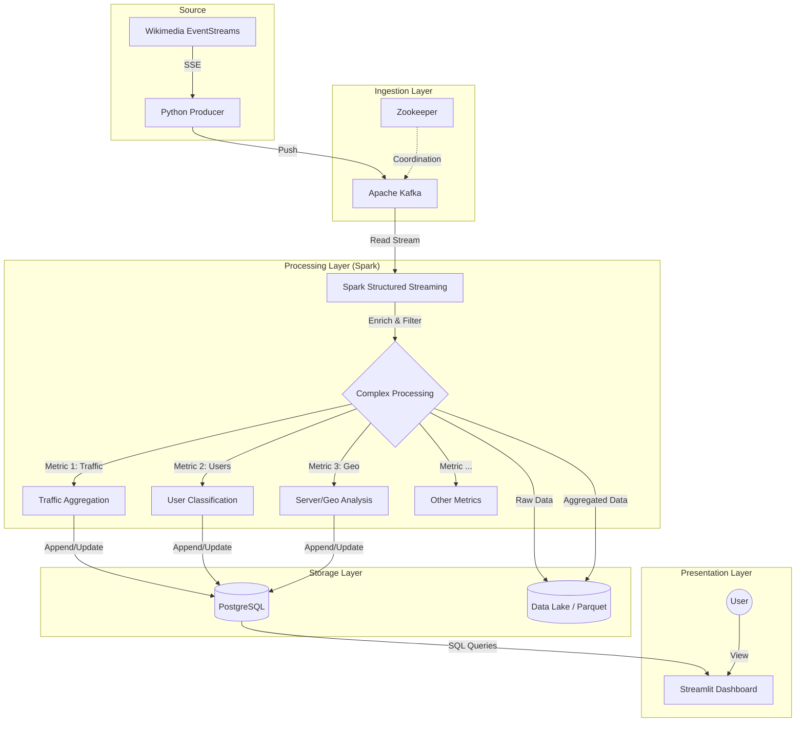

# Wiki Data Pipeline - Comprehensive Project Report

## 1. Executive Summary

This project is a **Real-time Big Data Pipeline** designed to ingest, process, and visualize Wikimedia's global "Recent Changes" stream. By leveraging the **Lambda Architecture** principles, the system provides both low-latency insights (Speed Layer) and long-term historical data storage (Batch/Serving Layer).

**Key Capabilities:**
*   **Real-time Ingestion**: Consumes thousands of events per second from Wikimedia's global event stream.
*   **Stream Processing**: Uses Apache Spark Structured Streaming to calculate complex analytics on the fly (traffic volume, bot detection, geolocation, content velocity).
*   **Live Dashboarding**: Presents sub-second latency visualization of global Wikipedia activity using Streamlit and Plotly.
*   **Scalable Infrastructure**: Containerized with Docker and orchestrated via Kubernetes for high availability and scalability.

---

## 2. System Architecture

The system follows a modern streaming data architecture:


<details>
<summary>View Source Code (Mermaid)</summary>



</details>

---

## 3. Directory Structure and Component Analysis

### 3.1. Project Structure
The codebase is organized into logical modules reflecting the data pipeline stages:

```
/home/thanh123/workspace/bigdata
├── ingestion/          # Producer service to fetch data from Wikimedia
├── processing/         # Spark jobs for stream processing
├── dashboard/          # Streamlit UI for visualization
├── infrastructure/     # Infrastructure as Code (Docker, K8s)
├── config/             # Centralized configuration management
├── datalake/           # Local storage for raw/processed data
└── run_all.sh          # Master script for Kubernetes deployment
```

### 3.2. Detailed Component Breakdown

#### A. Ingestion Layer (`ingestion/`)
*   **Core File**: `producer.py`
*   **Function**: Acts as the entry point for data. It connects to the Wikimedia `v2/stream/recentchange` Server-Sent Events (SSE) API.
*   **Key Features**:
    *   **Filtering**: Removes noise (e.g., 'talk' pages, irrelevant namespaces).
    *   **Enrichment**: Adds computed fields like `bytes_changed`, `is_bot`, `language`, `project` (derived from server domain).
    *   **Kafka Integration**: Serializes JSON events and pushes to the `wiki-raw-events` Kafka topic. Includes connection resilience and batching.

#### B. Processing Layer (`processing/`)
*   **Core File**: `stream_job.py`
*   **Technology**: Apache Spark Structured Streaming (PySpark).
*   **Function**: Reads from Kafka, parses JSON, and computes comprehensive real-time metrics.
*   **Metrics Calculated**:
    1.  **Traffic Volume**: Total bytes and event counts (sliding window).
    2.  **User Distribution**: Bot vs. Human activity ratios.
    3.  **Action Breakdown**: Types of actions (edit, new, log).
    4.  **Server Activity**: Top active Wikimedia projects (en.wiki, fr.wiki, etc.).
    5.  **Content Velocity**: Events per second.
    6.  **Leaderboards**: Top edited pages and most active users.
    7.  **Edit Severity**: Distinction between minor and major edits.
    8.  **Content Volume Change**: Net additions vs. deletions.
*   **Storage Strategy**:
    *   **Speed Layer (PostgreSQL)**: Aggregated metrics are written via JDBC for low-latency dashboard querying.
    *   **Batch Layer (Data Lake)**: Raw events and metrics are archived in Parquet format for historical analysis.

#### C. Dashboard Layer (`dashboard/`)
*   **Core File**: `app.py`
*   **Technology**: Streamlit, Plotly, Pandas.
*   **Function**: Visualizes the insights stored in PostgreSQL.
*   **Key Features**:
    *   **Live Key Performance Indicators (KPIs)**: Total events, volume, velocity.
    *   **Interactive Controls**: Adjustable lookback windows (1 min - 3 hrs), refresh rates, and filters.
    *   **Advanced Charts**:
        *   **Real-time Scatter Plot**: "The Battlefield" - visualizes edits as they happen (size = impact, color = add/del).
        *   **Dynamic Leaderboards**: Top servers, languages, and pages.
        *   **User Engagement Histograms**: Distributions of user activity levels.
    *   **Monitoring**: Keyword-based "Blacklist Monitor" to track specific terms in real-time.

#### D. Infrastructure (`infrastructure/` & `config/`)
*   **Configuration**: `config/settings.py` uses `pydantic` dataclasses and `python-dotenv` for robust, environment-aware configuration (Dev vs. Prod).
*   **Kubernetes**:
    *   `k8s/` contains manifests for `zookeeper`, `kafka`, `postgres`, `wiki-producer`, `wiki-spark`, and `wiki-dashboard`.
    *   Defined Services, Deployments, and ConfigMaps for a complete microservices architecture.
*   **Docker**: Multistage builds for Python services to keep image sizes optimized.

---

## 4. Key Workflows

### 4.1. Data Flow
1.  **Event Generation**: A user edits a Wikipedia page anywhere in the world.
2.  **Ingestion**: `wiki-producer` receives the SSE event within milliseconds, enriches it, and pushes to Kafka topic `wiki-raw-events`.
3.  **Processing**: `wiki-spark` picks up the record from Kafka.
    *   It parses the JSON payload against `processing/schemas.py`.
    *   Aggregates the data into 1-minute tumbling windows (with watermark for late data).
    *   Updates 10+ distinct metric tables in PostgreSQL.
4.  **Visualization**: The Dashboard polls PostgreSQL every ~2-10 seconds (configurable) and updates the UI charts to reflect the latest global state.

### 4.2. Deployment Workflow
The `run_all.sh` script orchestrates the deployment on Kubernetes (Minikube):
1.  Checks Minikube status.
2.  Verifies all Pods (Zookeeper, Kafka, Postgres, Apps) are `Running`.
3.  Exposes the Dashboard service URL for user access.

---

## 5. Technology Stack Summary

| Layer | Technologies |
| :--- | :--- |
| **Language** | Python 3.10+ (Type Hinting, Pydantic) |
| **Ingestion** | `requests` (SSE), `kafka-python` |
| **Streaming** | Apache Spark (PySpark) 3.5.x |
| **Message Queue** | Apache Kafka, Zookeeper |
| **Database** | PostgreSQL 15 |
| **Visualization** | Streamlit, Plotly Express |
| **Infrastructure** | Docker, Kubernetes (Minikube), Bash |
| **Format** | Parquet (Data Lake), JSON (Streaming) |

---

## 6. Recommendations & Future Improvements

1.  **Schema Registry**: Move schema definitions from `processing/schemas.py` to a managed Schema Registry (like Confluent) for better evolution support.
2.  **Alerting**: Add an alerting submodule (e.g., via Slack/Email) in the Spark job to notify when "Blacklist" terms are detected or Velocity spikes.
3.  **CI/CD**: Implement a GitHub Actions pipeline to auto-build Docker images and deploy to K8s on merge.
4.  **Data Quality**: Implement Great Expectations or similar to validate data quality before entering the Data Lake.

---
*Report Generated by Antigravity Agents - 2026-01-09*
